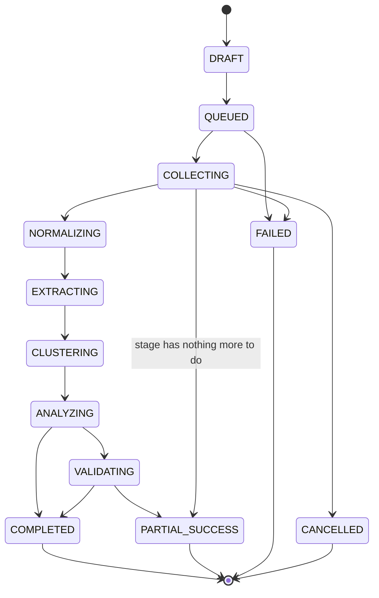
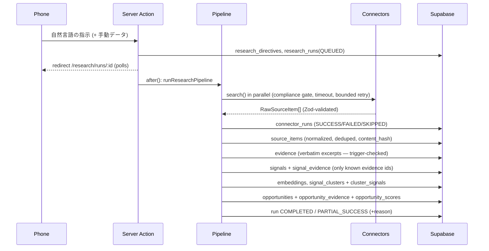

# Architecture

## Layers

```mermaid
flowchart TB
  subgraph UI["src/app + src/components (Next.js App Router, mobile-first PWA)"]
    pages[Server Components] --> actions[Server Actions]
  end
  subgraph APP["src/application (use cases, no I/O details)"]
    create[createResearch] --> pipeline[runResearchPipeline]
    pipeline --> collect[collectSources]
    pipeline --> stages[evidence → signals → clusters → opportunities]
    redteam[runRedTeam]
    decide[decideOpportunity]
    friday[LocalFridayAdapter]
    runner[AgentRunner<br/>budget + call limits + logs]
    queries[queries (read models)]
  end
  subgraph AG["src/agents (bounded AI employees)"]
    director[MarketDirector] & miner[PainMiner] & jtbd[JTBDAnalyst] & red[RedTeam] & namer[ClusterNamer]
  end
  subgraph DOM["src/domain (pure TypeScript, no dependencies on infra)"]
    sm[state machines] & score[score/confidence] & ev[evidence integrity] & dedup & budget & compliance & authz
  end
  subgraph INF["src/infrastructure"]
    supa[Supabase repositories<br/>(user-scoped client → RLS)]
    mem[Memory repositories<br/>(tests, demo)]
    ai[AIProvider: Anthropic / none]
    emb[EmbeddingProvider: local hash]
  end
  subgraph CON["src/connectors (MarketConnector port)"]
    manual & web[web_search] & estat & x & places[google_places] & ta[tripadvisor] & scaffolds
  end
  actions --> APP
  pages --> queries
  APP --> AG
  APP --> DOM
  AG --> DOM
  APP -->|ports| INF
  APP -->|ports| CON
  supa --> DB[(Supabase Postgres + pgvector<br/>RLS on every table)]
```

Rules enforced by structure:

- Business rules live in `src/domain` (pure) and `src/application` (orchestration). React components only render read models and call server actions.
- Infrastructure is reached only through ports (`src/application/ports/repositories.ts`, `MarketConnector`, `AIProvider`, `EmbeddingProvider`).
- The production repositories use the **user-scoped** Supabase client so every query runs under RLS. The service-role key is not used by the web app.

## Research run lifecycle



(Every active state may go to FAILED/CANCELLED; NORMALIZING…VALIDATING may end as PARTIAL_SUCCESS.)
The matrix exists twice — `src/domain/research/run-state-machine.ts` and the SQL trigger — and a unit test parses the SQL to prove they are identical.

## Pipeline



Execution model (MVP): the pipeline runs in-process via Next.js `after()` right after the response. This keeps the first vertical slice simple; Milestone 3 moves execution to a queue/cron worker (Supabase Queues or pg_cron) behind the same `runResearchPipeline` function.

## Key decisions

| Decision | Choice | Why |
|---|---|---|
| Tenancy | organization_id on every row + composite FKs `(id, organization_id)` | Cross-tenant references are impossible even with a bug in app code |
| Authorization | RLS via `private.is_org_member/has_org_role` (security definer, private schema) | Single source of truth; `user_metadata` never used |
| AI output | Zod schemas; unknown evidence ids rejected; deterministic fallback | No hallucinated evidence, graceful degradation |
| Agents | Explicit workflow + `AgentRunner` (per-agent call cap, budget check, log) | No unbounded autonomous loops |
| Embeddings | `vector(1536)` + HNSW; local feature-hash provider by default | Works offline at zero cost; 1536 matches common hosted models for later swap |
| Clustering | Single-pass centroid clustering + category guard + rule naming | MVP: no heavy ML infrastructure |
| Background work | `after()` now, queue later | Ship the vertical slice first |
| Demo mode | explicit `MRO_DEMO_MODE=true`, in-memory store | E2E and local evaluation without external services |
