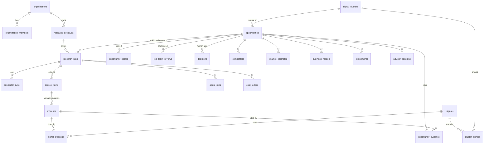

# Database

Supabase PostgreSQL 15+ with `pgvector`. Migrations: `supabase/migrations/`.

| File | Contents |
|---|---|
| `20261003000100_foundation.sql` | extensions (`pgcrypto`, `vector`), `private` schema, `org_role` enum, helpers |
| `20261003000200_core_schema.sql` | all tables, indexes, composite tenant FKs, `updated_at` triggers |
| `20261003000300_integrity.sql` | state machine, verbatim-evidence, decision gates, scoring weights, last-owner triggers |
| `20261003000400_security.sql` | grants, RLS policies, security-definer entry points, signup bootstrap, system defaults |
| `20261003000500_m1_compliance_audit.sql` | compliance vocabulary (`RESTRICTED`, `DISABLED`), connector terms notes |
| `20261003000600_m2_research_engine.sql` | `signals.field_provenance`, `connector_runs.cost_usd` |
| `20261003000800_m4_executive_os.sql` | decision memory (`subject`, `source`), CEO gate (PoC approval/launch need an admin/owner decision), watchlist target validation + dedupe, MARKET target, notification dedupe/severity + self-insert policy, `feedback_events`, `opportunity_lineage` view (security_invoker) |
| `20261003000700_m3_opportunity_engine.sql` | experiment fields + state machine trigger + human attribution, `opportunity_evidence.source_run_id`, business model rationale, one primary model per opportunity, members may regenerate competitor/business-model analyses |

## Conventions

- UUID primary keys, `timestamptz`, `created_at`/`updated_at`, flexible payloads in `jsonb`.
- Every tenant row has `organization_id`; parents expose `UNIQUE (id, organization_id)` and children reference them with **composite foreign keys**.
- `source_items`: `content_hash` (sha256 of normalized title+body), `external_id`, `canonical_url`; unique `(research_run_id, content_hash)` and partial unique `(research_run_id, connector_key, external_id)`.
- Vector columns: `signals.embedding`, `signal_clusters.centroid` — `vector(1536)` with an HNSW cosine index on signals.
- Deletion policy: `source_items.retention_until` (raw third-party text expires; default window in `system_settings.retention.source_items_days`); `ON DELETE CASCADE` from organization; decisions/users use `RESTRICT` so human decisions are never silently lost.

## Entity relationships (core)

## Tables

Required set: profiles, organizations, organization_members, research_directives, research_runs, connectors, source_items, evidence, signals, signal_clusters, cluster_signals, opportunities, opportunity_evidence, opportunity_scores, competitors, market_estimates, business_models, experiments, watchlists, reports, agent_runs, decisions, advisor_sessions, notifications, compliance_checks, cost_ledger, audit_logs, system_settings, scoring_settings.

Additional tables:

| Table | Why |
|---|---|
| `signal_evidence` | Real FK from a signal to every evidence it cites (no array of unverifiable ids) |
| `connector_runs` | Per-connector observability (status, count, duration, retries, error) |
| `red_team_reviews` | Stored red-team findings (12 questions) per opportunity |

## Integrity enforced in the database

| Rule | Mechanism |
|---|---|
| Evidence text is a verbatim excerpt of its source body | `enforce_evidence_integrity` trigger (`position(evidence_text in body) > 0`) |
| No invented evidence ids | FKs on `signal_evidence` / `opportunity_evidence`; `enforce_evidence_id_array` for `market_estimates` / `competitors` id arrays |
| Run state machine | `enforce_research_run_transition` (+ timestamps) |
| Opportunities start as DISCOVERED, legal transitions only | `enforce_opportunity_gate` |
| VALIDATED and beyond require linked evidence | same trigger |
| EXPERIMENT_APPROVED / POC_APPROVED / LAUNCHED / REJECTED require a matching human decision | same trigger checks `decisions` |
| Scoring weights: known keys, non-negative, sum = 100 | `enforce_scoring_weights` |
| Organization keeps ≥1 owner | `protect_last_owner` |
| Market estimates are CALCULATION with formula/inputs/assumptions | NOT NULL + CHECK |

## Functions

| Function | Security | Purpose |
|---|---|---|
| `private.is_org_member(org)`, `private.has_org_role(org, role)` | definer, not exposed via API | RLS helpers |
| `public.create_organization(name)` | definer, authenticated only | creates org + owner membership + default scoring |
| `public.record_audit_event(...)` | definer, member check, actor forced to `auth.uid()` | append-only audit |
| `public.org_spend_usd(org, since)` | invoker (RLS applies) | budget enforcement |
| `private.handle_new_user()` | trigger on `auth.users` | profile + personal workspace |
