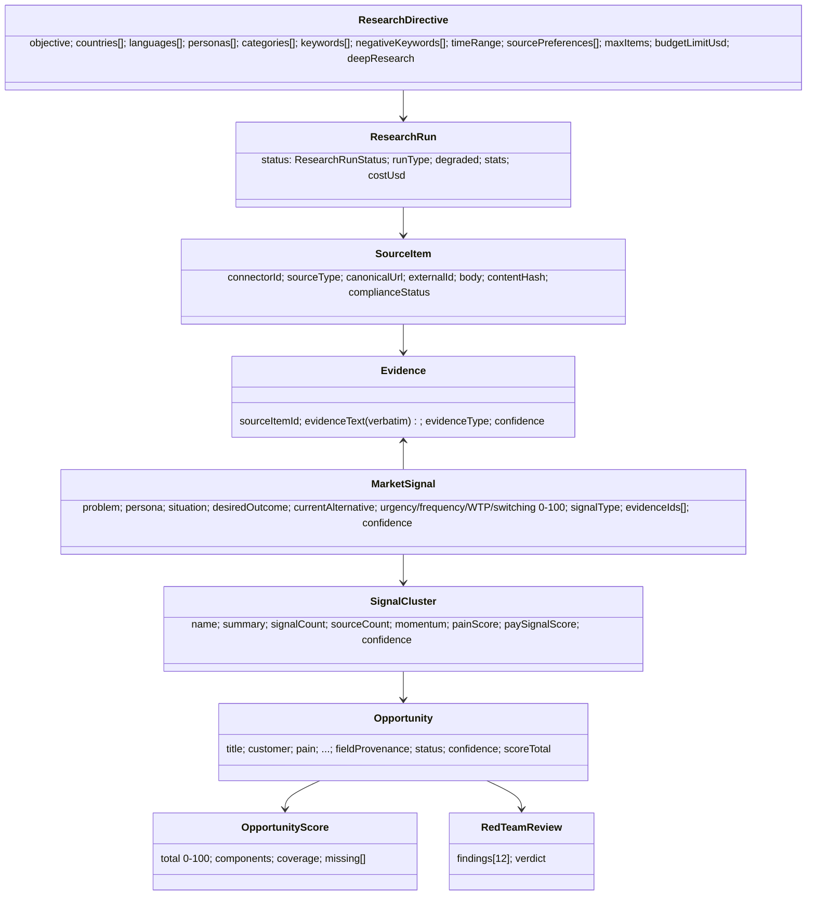
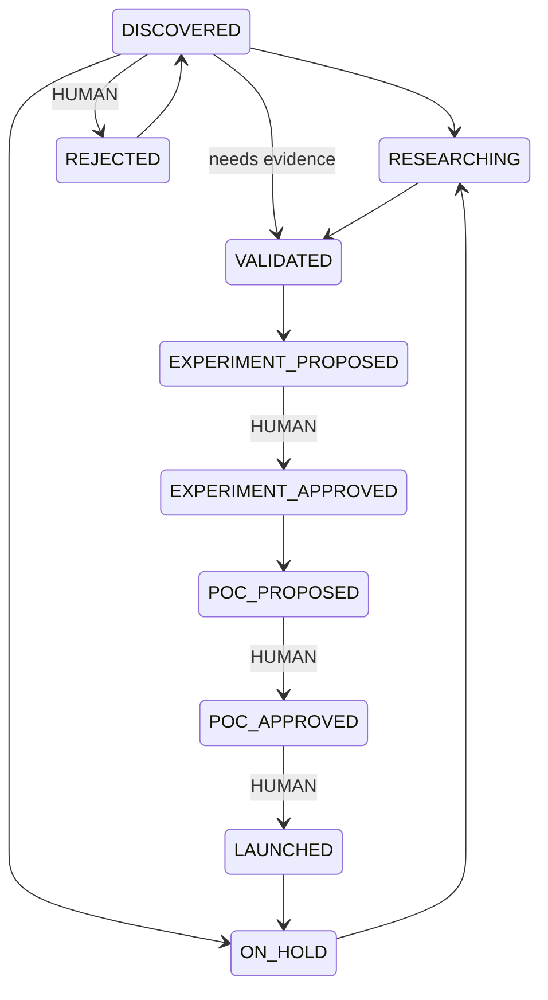

# Domain Model

All in `src/domain` — pure TypeScript, Zod for validation, no I/O.

## Epistemic status

`FACT` (verbatim from evidence) · `INFERENCE` (derived from evidence) · `HYPOTHESIS` (to be tested) · `ASSUMPTION` (unverified prior) · `CALCULATION` (formula + inputs).
`assertClaimIsGrounded`: a FACT must cite evidence; a CALCULATION must carry its formula. Opportunities carry `fieldProvenance` per field.

## Signal types

PAIN, ANXIETY, REQUEST, SHORTAGE, WORKAROUND, SWITCHING, PAY_SIGNAL, PRICE_GAP, ACCESS_GAP, TRUST_GAP, INFORMATION_GAP, DISTRIBUTION_GAP, CAPACITY_GAP, REGULATION_GAP.

## Opportunity score (default weights, total 100)

Pain Severity 15 · Frequency 10 · Willingness to Pay 10 · Market Size 10 · Trend Momentum 8 · Existing Solution Gap 8 · Distribution Advantage 7 · Monetization Quality 7 · Buildability 6 · Defensibility 5 · Regulatory Feasibility 5 · Time to Revenue 4 · Strategic Fit 2 · Social Value 3.

- Each criterion takes a value 0..1 **or null**. Null = not yet assessed → a neutral prior (0.5) is applied **and labelled ASSUMPTION**; `coverage` reports the share of weight backed by real assessment.
- M1 derives only Pain, Frequency, WTP, Existing-Solution-Gap and (when ≥3 dated observations) Momentum from signals. Market size etc. remain unassessed until the M2 analysts run.
- Weights are per-organization (`scoring_settings`), validated (sum = 100) in both Zod and SQL.

## Confidence (independent of score)

Composite of source quality (0.25), source diversity (0.2), freshness (0.15), evidence volume (0.2), cross-source agreement (0.2) minus a contradiction penalty, mapped to LOW/MEDIUM/HIGH, with hard caps:
`< 3 evidence → LOW`, `single channel → ≤ MEDIUM` (no conclusions about a whole market from one SNS), `contradictions → ≤ MEDIUM`.
`interpretScoreAndConfidence(91, LOW)` → 「非常に魅力的だが証拠不足」.

## Deduplication

1. same connector + `external_id` 2. same `content_hash` (NFKC, lower-case, URLs/whitespace/punctuation removed) 3. same `canonical_url` — only for items **without** an external id (reviews share a page URL) 4. optional semantic comparator.

## Decision gates

## Budget

`checkBudget(limits, spent, estimate)` checks per-run, daily and monthly limits and returns a user-facing reason. `BudgetTracker` accumulates spend within a run. Paid (optional) AI work is skipped when it would exceed a limit; deterministic steps (cost 0) continue so collected data is still turned into results.

## Compliance gate

A connector may collect only if: effective status (stricter of code profile and org override) is `APPROVED`, it is enabled, and required credentials exist.
